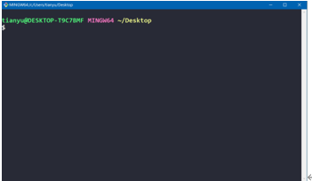
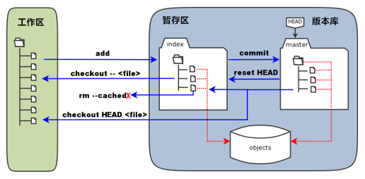
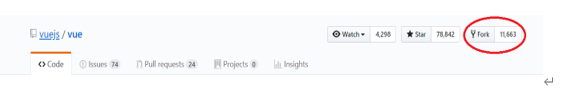
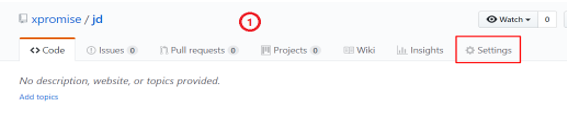
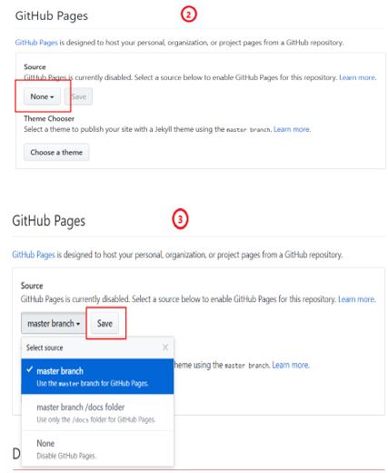
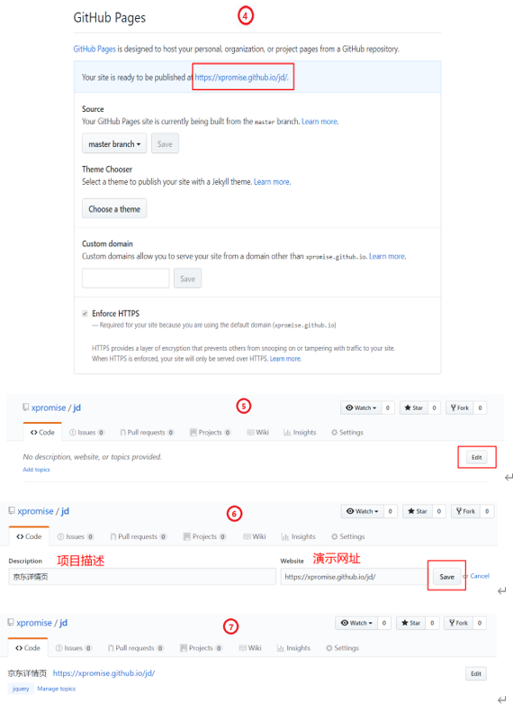
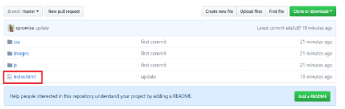

## Git

[toc]

### 一、Git的起源

#### 1. “自由主义教皇”林纳斯·托瓦兹

- Linux

- Git

  

#### 2. Git是什么？

- Git是目前世界上最先进的分布式版本控制  （没有之一）。

### 二、Git的使用

#### 1. Git 的安装

- Windows版的Git，从https://git-scm.com/download/win下载然后按默认选项安装即可。

- 安装完成后，右键打开菜单栏找到“Git”->“Git Bash”，蹦出一个类似命令行窗口的东西，就说明Git安装成功！

- 安装完成后，还需要最后一步设置，在命令行输入：
  - git config --global user.name "Your Name" 
  - git config --global user.email "email@example.com" 
  - git config user.name 查看配置的姓名
  - git config user.email 查看配置的邮箱
  - 因为Git是分布式版本控制系统，所以，每个机器都必须自报家门：你的名字和Email地址。

#### 2.Linux 的命令

- `` mkdir xxx ``新建文件夹
- ``vi x.txt``新建文件 ( Visual editor)
  - 输入``i``进入编辑模式
  - `ESC +  :  wq `保存并退出
  - `ESC + : Q!` 不保存并推出
- `cd xxx 进入 xx  目录`
- `cd ../返回上级目录`
- `ls 列出当前文件夹中的所有文件`
- `pwd 显示当前目录`
- `cat x.txx`显示当前文件内容
- `clear 清屏`

#### 3. 创建版本库

**1、git init初始化版本库**

> 创建成功会提示 Initialized empty Git repository in c:/Users/xxx/Desktop/demogit/.git/
>
> 没有初始化执行git命令，会提示fatal: Not a git repository (or any of the parent directories): .git
>
> 你还会发现目录上多出一个.git的文件夹,这个文件夹是Git来跟踪管理版本库的，不要去修改和删除这个文件里的内容。

**2、  git add x.xx添加指定文件到暂存区中**

> 不会有任何提示，但是提交成功了
>
> 失败会提示fatal: pathspec 'x.txt' did not match any files
>
> 可能会出现警告，由于linux和window的换行符不一致导致的。
>
> 警告内容：warning: LF will be replaced by CRLF in a.txt. 
>
> 解决方式：git config --global core.autocrlf false 

**3、怎么查看文件有没有添加成功呢？**

> ` git status `
>
> 1. 红色表示在工作区。
>
> 2. 绿色表示在暂存区。
>
> 3. 没有任何显示代表所有文件位于版本区。

**4、 git commit -m 'xxx' 提交暂存区所有文件到版本区**

> 提交成功会提示：
>
> ` [master (root-commit) 88bbb64] first commit
>     1 file changed, 2 insertions(+)
>     create mode 100644 x.txt`
>
> 如果只输入git commit会出问题，这时需要ESC + ：+ q! 退出就好

#### 4. 理解工作区+版本区+暂存区

- 工作区（working Directory）：简单的理解——你在电脑里能看到的目录。

- 暂存区（stage）：介于工作区和版本区中间，工作区到版本区的“必经之路” 

- 版本库（Repository）：工作区有一个隐藏目录.git，准确的来说这个不算工作区，而是Git的版本库。
  -  第一步是用git add把文件添加进暂存区。
  - 第二步是用git commit把暂存区的所有内容提交到当前版本库。

#### 5.  差异对比  

- git diff : 比较暂存区与工作区

- git diff --cached : 比较版本区与暂存区

- git diff master : 比较版本区与工作区

#### 6. 日志+版本号

- git log 显示从最近到最远的所有提交日志

- git reflog 显示每次提交（commit）的commit id

#### 7. 版本回退+版本穿梭+版本撤销

- git reset --hard HEAD^  版本回退（回退一次提交）
- git reset --hard Obfafd  回退到指定Obfafd的commit id版本
- git reset HEAD         用**版本库中**的文件去替换**暂存区**的全部文件。
- git checkout -- x.txt    用**暂存区指定文件**去替换**工作区的指定文件**（危险）
- git checkout HEAD x.txt 用**版本库中的文件**替换**暂存区**和**工作区的文件**（危险）
- git rm --cached x.txt     从**暂存区**删除文件

#### 8. 删除文件

- git rm x.txt 删除文件
- git rm -r xxx 删除文件夹

**Git 完整图：**

#### 9. 分支

- `git checkout -b dev`  创建dev分支，并切换到dev分支
- `git branch` 查看当前分支 
- `git checkout master` 切换分支
- `git merge dev` 合并 dev 分支到当前分支

#### 10. 版本冲突

- 合并分支时，如果在同一个文件，在同一个地方，都修改了或新增内容会引起版本冲突    
- 解决版本冲突最好的办法是借助IDE解决，简单且高效。

#### 屏蔽文件

> 在 IDE 中新建: `.gitignore文件`   里面编写要屏蔽的文件： `.idea`

### 三、版本控制系统的区别  

#### 1. 集中式版本控制系统

代表有SVN、CVS

​    集中式版本控制系统，版本库是集中存放在中央服务器的，每个开发人员电脑里只有其中一个版本。

#### 2. 分布式版本控制系统

 代表有Git、BitKeeper

​    每个开发人员电脑里都有一个完整的版本库。同时，它也需要一台充当“中央服务器”的电脑，来方便“交换”大家的代码修改。

#### 3. 集中式与分布式的区别

| 类别    项目                             | 集中式版本控制系统                                           | 分布式版本控制系统                   |
| ---------------------------------------- | ------------------------------------------------------------ | ------------------------------------ |
| 主要区别                                 | 每个开发者只有应用代码库的一个版本。                         | 每个开发者都有整个代码库的所有版本。 |
| 在离线状态下开发者无法进行版本管理开发。 | 在离线状态下开发者可以进行版本管理开发, 等到有网时再push到仓库中。 |                                      |

### 三、GitHub

#### 1. GitHub是什么？

GitHub是一个Git项目托管网站。

#### 2. GitHub能做什么？

能够分享你的代码或者其他开发人员配合一起开发。

GitHub是一个基于Git的代码托管平台，Git并不像SVN那样有一个中心服务器。目前我们使用到的Git命令都是在本地执行，你就需要将数据放到一台其他开发人员能够连接的服务器上。

### 四、GitHub远程仓库的使用

#### 1. 本地仓库内容推送给远程仓库

​    **本地库和远程库打交道时，要注意将本地文件交给本地库管理**

1、**新建本地仓库 **

> ​    git init
>
> ​     git add *
>
>    git commit -m “first commit”

**2、新建远程仓库**

> GitHub上New repository

**3、本地仓库和远程仓库进行关联**

> git remote add origin https://github.com/xpromise/oa.git  (HTTPS)

**4、把本地仓库内容推送到远程仓库中**

> git push -u origin master （首次加-u）

我们第一次推送master分支时，加上了-u参数，Git不但会把本地的master分支内容推送到远程新的master分支，还会把本地master分支和远程的master分支关联起来，在以后的推送时可以简化命令`git push origin master`

备注：若在成功推送过一次代码后，电脑不能够自动记住github的账户和密码，执行以下命令解决：git config --global credential.helper store

#### 2. 远程仓库有内容克隆到本地进行开发

- 克隆远程仓库到本地

> git clone https://github.com/xxx.git (HTTPS)

#### 3. 本地有内容，远程有内容，更新不同的内容

>  `git pull origin master` 将远程仓库拉到本地来

#### 4. 配置SSH与使用

1. 输入cd ~/.ssh，由于你的本地Git仓库和GitHub仓库之间的传输是通过SSH加密的，所以我们需要配置验证信息。 No such file or directory 表示第一次

2. 创建SSH Key：ssh-keygen -t rsa -C ["xxx@xxx.com"](mailto:"xxx@xxx.com") 它会在~/下生成.ssh文件夹，进去打开id_rsa.pub文件复制里面全部的内容将其复制到你的GitHub里的SSH keys中

3.  使用

   git remote add origin [git@github.com:xpromise/oa.git](mailto:git@github.com:xpromise/oa.git)   (SSH)

   git clone git@github.com:xpromise/oa.git   (SSH)

----------------------------------

### 五、GitHub其他功能

#### 1. Fork

将别人的项目clone一份，但是owner变成自己，这样你就可以在遵守open source license的前提下任意修改这个项目了。

相当于你在原项目的主分支上又建立了一个分支，你可以在该分支上任意修改如果想将你得修改合并到元项目中式，可以pull request，这样原项目的作者就可以将你修改的东西合并到原项目的主分支上去，这样你就为开源项目贡献了代码，开源项目就会在大家的努力下不断地壮大和完善。

#### 2. GitHub Pages

**1、推送本地代码到GitHub仓库**

- 创建本地仓库

  - git init

  - git add .
  - git commit -m "xxx" 

- 创建GitHub远程仓库

- 本地仓库关联远程仓库
  - git remote add origin [git@github.com:xpromise/jd.git](mailto:git@github.com:xpromise/jd.git)

- 推送本地更新
  - git push -u origin master
- 更新本地
  -  `git pull origin master` 将远程仓库拉到本地来

**2、配置GitHub Pages选项**

​     

**3、需要注意的问题**

- 目录第一层需要有一个index.html文件作为启动文件，命名不可更改。

  